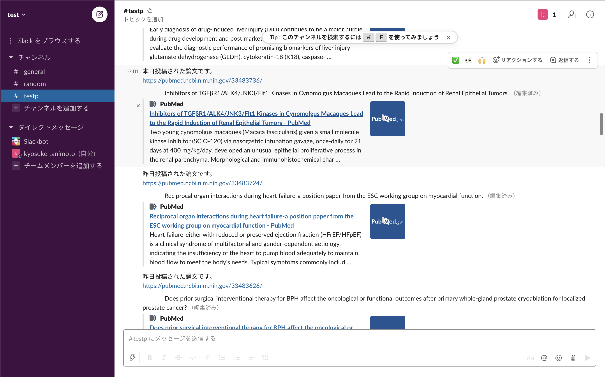
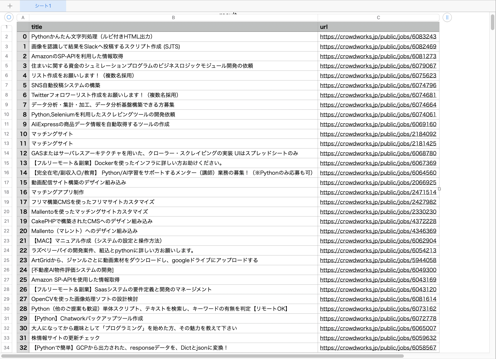

# Name
 
1.論文サイトの新着を slackに毎朝自動送信するアプリ  


2.クラウドソーシングサイトの新着をスクレイピングしてcsvファイルに書き込むアプリ  

 
# Features

pubmed.py  
医療論文サイトpubmedを前日および当日(朝7時まで)分スクレイピングしてslackに自動通知する。

crowdworks.py  
クラウドソーシングサイトであるクラウドワークスの「python」案件を新着順に並べスクレイピングしてタイトルとURLをcsvファイルに保存する。

fileup.py  
csvファイルをslackに送信する。

# Points

pubmed.py  
slackAPIを用いてAWS Cloud9とつなげることができる。  
Herokuを用いて決まった時間に自動実行できる。  

crowdworks.py  
seleniumおよびchromedriverを用いたスクレイピングツール
 
# 実行環境

EC2

# 注意

pubmed.pyおよびfileup.pyのパスワードはセキュリティー上サーバーに設定してある。

# Requirement
 
"pubmed.py"を動かすのに必要なライブラリ

requirements.txt  
runtime.txt

# Installation
 
Requirementで列挙したライブラリなどのインストール方法
 
```bash
sudo yum install python37 python37-virtualenv python37-pip

sudo python3 -m pip install bs4  
sudo python3 -m pip install selenium  
sudo python3 -m pip install requests  
sudo python3 -m pip install tweepy  
```
 
# Usage
 
"pubmed.py"の基本的な使い方
 
```bash
git clone https://github.com/tanimoyan/test-selenium-app.git  
python3 pubmed.py
```
 
# Author
 
* tanimoto